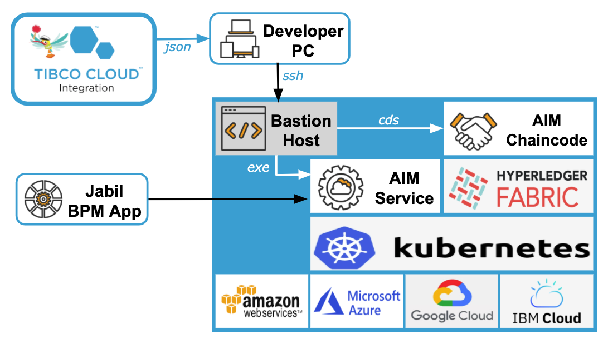

# Jabil AIM Blockchain Demo

## Business Requirements

- **Maintain supplier info**: Edit and store a list of suppliers and authorized users for the distributed ledger.
- **Manage lifecycle of rebate agreements**: Edit and store agreements between Jabil and a supplier for terms of rebates; effective agreements must be approved by both parties.
- **Process bulk load**: Both Jabil and a supplier can load PO records into the system in batches.
- **Manage workflow of purchase item reconciliation**: Manage automatic or manual reconciliation of purchase amounts; reconciled PO items must be verified by both parties with the same sales price.
- **Calculate rebate amount according to agreement**: Summarize total sales amount of reconciled items, and calculate rebate amount according to the rebate terms in an agreement.

## Key Artifacts

- Chaincode Model: `jabil_aim.json` (Import it to Flogo to view);
- REST Service Model: `aim_rest.json` (Import it to Flogo to view);
- Chaincode Transaction Definition: `contract-metadata/metadata.json` (Generated from chaincode model);
- GraphQL Service Definition: `aim.gql` (Generated from chaincode model, then edited for addtional docs);
- gRPC Service Definition: `aim.proto` (Created based on GraphQL definitions);
- REST Service Definition: `aim.swagger.json` (Generated from gRPC defintions);
- REST test messages: `jabil_rest.postman_collection.json` (Import it to Postman to view and send REST requests);
- `Makefile` (Defines operations for local testing using Fabric's `byfn` sample network);
- Kubernetes Cluster Parameters: `jabil.env` (Defines parameters for blockchain network in local or cloud Kubernetes services);
- `k8s-network.sh` (Configure and start Fabric network in local or cloud Kubernetes services);
- `k8s-aim.sh` (Deploy and start AIM chaincode and REST service in local or cloud Kubernetes services)

## Test Local Deployment

Follow the instructions [here](https://github.com/dovetail-lab/fabric-cli) to setup the Dovetail development environment on Mac or Linux.

Start and test AIM chaincode:

```bash
# build chaincode package
make build

# copy chaincode package to fabric test-network
make deploy

# start fabric test-network
make start

# install AIM chaincode
make cli-init

# send test requests for AIM chaincode
make cli-test
```

View state data on the blockchain by using the CouchDB UI: [http://localhost:5984/\_utils](http://localhost:5984/_utils).

Start and test REST service for AIM:

```bash
# build AIM service
make build-client

# start AIM service
make run
```

View REST APIs documentation by importing the file `aim.swagger.json` to Swagger editor at [http://editor.swagger.io/](http://editor.swagger.io/).

Download `Postman` from [https://www.postman.com/downloads/](https://www.postman.com/downloads/). Import test message file `jabil_rest.postman_collection.json` to Postman, and send test requests in specified sequence.

Shutdown local Fabric network:

```bash
make shutdown
```

## Test Cloud Deployment



We use Azure here, but the scripts work similarly for AWS and GCP.

Start Azure Cluster:

```bash
cd /path/to/dovetail-lab/fabric-operation/az
az login
./az-util.sh create
```

Wait 10-20 minutes, until it started the Azure cluster and printed out the connection info for the bastion host, e.g.,

```bash
ssh fab@51.143.17.95
```

Zip and copy the AIM scripts (i.e., the content of this folder) to Azure bastion host:

```bash
cd ${WORK_PATH}
tar cvfz jabil-aim.tar.gz ./jabil-aim

# use your bastion host IP here
scp jabil-aim.tar.gz fab@51.143.17.95:
```

Login to Azure bation host and start Fabric network, install AIM chaincode and start the AIM REST service:

```bash
# Your bastion host IP will be different here
ssh fab@51.143.17.95

# make sure that kubernetes is configured
kubectl get pod,svc --all-namespaces

# unzip AIM scripts
tar xvfz jabil-aim.tar.gz

# configure and start Fabric network
cd ./jabil-aim
./k8s-network.sh start

# optionally verify the generated certificate of a demo user, e.g.
openssl x509 -in /mnt/share/jabil.com/crypto/users/jack@jabil.com/msp/signcerts/jack@jabil.com-cert.pem -noout -text

# deploy AIM chaincode and start AIM REST service
./k8s-aim.sh deploy
```

When it completes successfully, it should print out the URL of the AIM REST service, e.g.,

```bash
access aim-rest servcice at http://52.143.91.17:7091
```

You can then replace the test URL in Postman, and send requests to the blockchain in Azure.

The services can be stopped using the following commands:

```bash
# shutdown AIM REST service
cd ./jabil-aim
./k8s-aim.sh shutdown

# shutdown Fabric network
./k8s-network.sh shutdown
```

Shutdown and cleanup Azure cluster from local host:

```bash
cd /path/to/dovetail-lab/fabric-operation/az
az login
./az-util.sh cleanup
```

## Developer Notes

Steps used to develop this app:

- Use Flogo Enterprise 2.10.0 to create chaincode model as defined by business requirements;
- Export chaincode model as `jabil_aim.json`, and `make build` to build chaincode, then deploy and test it;
- `make metadata` to generate chaincode interface metadata as `contract-metadata/metadata.json`;
- Optionally, use Flogo to create GraphQL service using the generated metadata `contract-metadata/metadata.gql`;
- For gRPC and REST service, we create gRPC service definitions `aim.proto` based on the `metadata.gql`;
- `make grpc-gateway` to install required Go packages for generating REST API defintions;
- `make gen-swagger` to generate REST API defintion `aim.swagger.json` from the gRPC definitions in `aim.proto`;
- Use Flogo Enterprise 2.10.0 to create REST service model that implements the REST APIs of `aim.swagger.json` and invokes chaincode transactions defined by `metadata.json`;
- Export REST service model as `aim_rest.json`, and `make build-client` to build the REST service, and then perform end-to-end test by using `Postman`.
